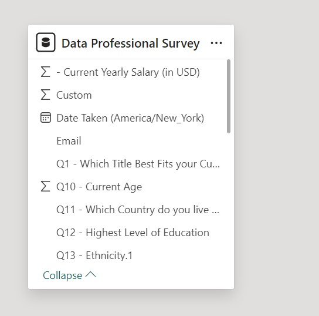

## Introduction

This is a Power BI project that show analysis and visualization of Data for Proffesion in the Data Fields. The data Analyzed called **Data Proffesional Survey**.
#### **_Disclaimer_** :  _The Data set and Report involved i this project does not reflect on any Company, Institution or Country but rather a dummy dataset for showcasing skills._
---

---

## Problem Statement
The project focuses on answering the following questions.

1. The average age of the proffesions in the field.
2. What is the relationship between the genders and the average salary.
3. Which programming langiage domibnates the data proffesion.
4. Countries where the proffesion earns more.
5. Which is the favourite programming language in this proffesion.
6. How is the work life balance for proffesions in this field.
7. The relationship between age, education and the proffesional in varios  the countries.

**Each of the a bove question was ansered in the progress and finalization of this project report.**

## Core Skill Used in the Project.
- Book marking
- Data Analytics Expresion (DAX)
- Data cleaning
- Quick measures
- Modelling
- Filters
- Tooltip and
- Visualization

## Modelling

The data involved in this project had no relationship as the dataset was one as shown in the auto-model tank below:

