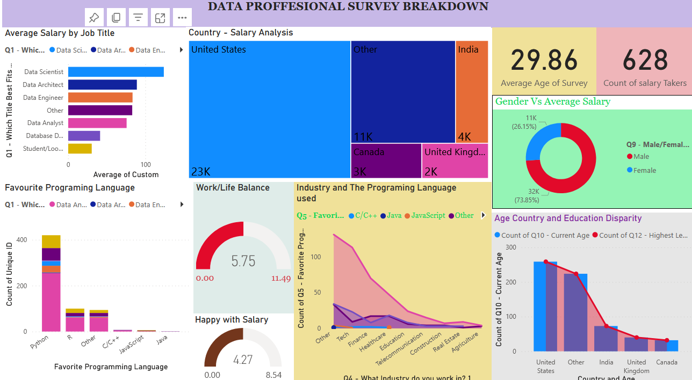

## Introduction

This is a Power BI project that show analysis and visualization of Data for Proffesion in the Data Fields. The data Analyzed called **Data Proffesional Survey**.
#### **_Disclaimer_** :  _The Data set and Report involved i this project does not reflect on any Company, Institution or Country but rather a dummy dataset for showcasing skills._
---

---

## Problem Statement
The project focuses on answering the following questions.

1. The average age of the proffesions in the field.
2. What is the relationship between the genders and the average salary.
3. Which programming langiage domibnates the data proffesion.
4. Countries where the proffesion earns more.
5. Which is the favourite programming language in this proffesion.
6. How is the work life balance for proffesions in this field.
7. The relationship between age, education and the proffesional in varios  the countries.

**Each of the a bove question was ansered in the progress and finalization of this project report.**

## Core Skill Used in the Project.
- Book marking
- Data Analytics Expresion (DAX)
- Data cleaning
- Quick measures
- Modelling
- Filters
- Tooltip and
- Visualization

## Modelling

The data involved in this project had no relationship as the dataset was one as shown in the auto-model tank below:

---

## Visualization

The report comprises of a one detaied page visualizing the answers to all questions and issues that we would like to 
to have. The insights are well depicted as below:

You can interact with the report here (https://app.powerbi.com/groups/me/reports/0c5c1ec0-8774-45fc-b5d6-dd3de0ffa709/ReportSection?experience=power-bi) All buttons have their respective question they are answering.

---

## Conclusion and Recommendation.
**From the analysis, the following conclusion and finding were arrived at**:

        _ That data scients, architects and engineers earns the highest on average.
        - United States has posses the highest income from the proffesion.
        - Python language is more prefered and used by most proffesions in this field.
        - Only a  small fraction of the labour force in the proffesion have a stable worklife balance.
        - Most of the proffesionals in the field about 4% are ok with their salary.
        -That most of the programing language are used in the Tech industry,Telecommunication, Finance and Health sector.
        -The Average age of the proffesionals in the survey displayed implies that most of them might be youths below age of 30 year.
        - The Proffesion is dominated by Males at approximately 74% with each having a take home salary of about $32k on average.

_**Recomendation**_: For a deep dive into the analysis, the dataset has to be expanded and updated for better descision.      
